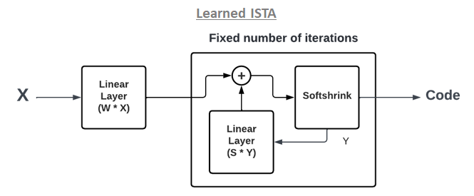

   

# About

A package for machine learning inference in FPGAs. We create firmware implementations of machine learning algorithms using high level synthesis language (HLS). We translate traditional open-source machine learning package models into HLS that can be configured for your use-case!

For more information visit the webpage: [https://fastmachinelearning.org/hls4ml/](https://fastmachinelearning.org/hls4ml/)

Detailed tutorials on how to use `hls4ml`'s various functionalities can be found [here](https://github.com/hls-fpga-machine-learning/hls4ml-tutorial).

# LISTA Block
The [LISTA](https://icml.cc/Conferences/2010/papers/449.pdf) model is implemented as a dense layer (**W**) + a custom layer called **LISTA_Block** which is added directly to the hls4ml code.    

   

  

# Added/Changed Files
- [*contrib/lista.py*](./contrib/lista.py) : Contains the Keras implementation of the LISTA Block
- [*hls4ml/backends/vivado/passes/lista_templates.py*](./hls4ml/backends/vivado/passes/lista_templates.py) : Config and function templates for the LISTA Block. Fairly similar to the Dense layer templates
- [*hls4ml/backends/vivado/vivado_backend.py*](./hls4ml/backends/vivado/vivado_backend.py) : Added layer optimizer at the end of the file. Exactly the same as the Dense layer
- [*hls4ml/converters/keras/lista.py*](./hls4ml/converters/keras/lista.py) : Added LISTA Block parser
- [*hls4ml/model/layers.py*](./hls4ml/model/layers.py) : Added LISTA_Block to the registered layer map
- [*hls4ml/templates/vivado/nnet_utils/nnet_lista.h*](./hls4ml/templates/vivado/nnet_utils/nnet_lista.h) : Header file containing the C++ code for the LISTA Block operations
- [*hls4ml/utils/config.py*](./hls4ml/utils/config.py) : Added LISTA Block to the list of supported layers